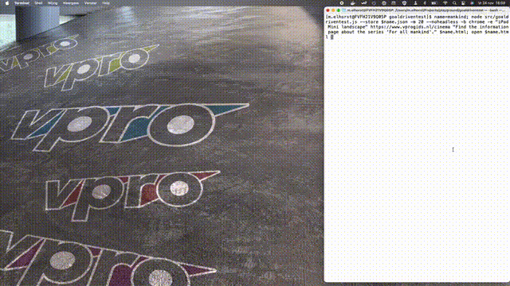
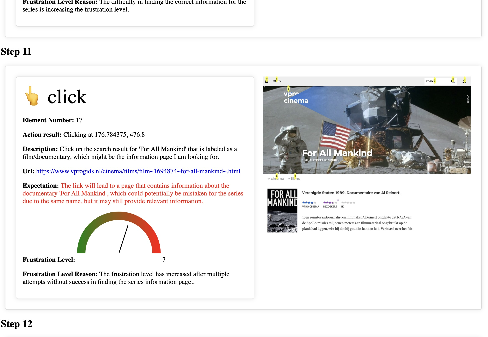

**GoalDrivenTest** 🎯

GoalDrivenTest is an innovative Proof of Concept tool designed to assess and test the user experience of a website. Instead of traditional manual testing or generic automated processes, it uses artificial intelligence to navigate and evaluate your website based on specific goals you set.

**Key Features and Benefits:**

1. **Goal-Driven Testing:** Simply specify a goal, and the AI will audit the site, aiming to achieve that goal as efficiently as possible.
  
2. **Feedback at Every Step:** As the AI navigates, it provides valuable insights, detailing its expectations and pointing out potential areas that could frustrate users.
   
3. **Simulated User Interactions:** One of the standout features of GoalDrivenTest is its ability to mimic various target audience behaviors. This lets website developers and designers gain insights into how different types of users might interact with and experience their website.
   
4. **Pre-Launch Insight:** Before making a website live, developers can get a sneak peek into the journey of potential visitors. This proactive approach helps in identifying and rectifying issues, ensuring a smoother user experience post-launch.

In essence, GoalDrivenTest offers an intuitive, insightful, and futuristic approach to website testing, making the process more dynamic and aligned with real-world user behaviors and expectations.

## Demo
See the screenrecording below. It's run with the goal "Find the information page about the series 'For All Mankind'." on the website www.vprogids.nl.cinema. You can clearly see that the AI is really aware of the content and gets frustrated that it cannot discriminate beforehand between a movie and series page. Quite impressive.

[](examples/mankind.mp4)

Below is the full report that was created during the recording above:
[](examples/mankind.html)

## Installation

Before you can harness the power of GoalDrivenTest, you need to get it up and running on your system.

**Prerequisites:**
- nodejs
- npm
- OpenAI API key

**Step-by-Step Installation:**
1. Clone the repository to your local machine:
   ```
   git clone https://github.com/mathijne/goaldriventest.git
   ```
2. Navigate to the cloned directory:
   ```
   cd goaldriventest
   ```
3. Install the necessary dependencies:
   ```
   npm install
   ```
4. Build for execution
   ```
   npm run build
   ```
5. Be able to run as 'goaldriventest' from the commandline:
   ```
   npm install -g
   ```
   
Typescript compilation in step 4 and 5 can be skipped and the program can be run directly using tsx also:
   ```
   npm run tsx -- 
   ```

## Usage

GoalDrivenTest operates from the command line.

**Basic Command Structure:**
```
goaldriventest https://yourwebsite.com "state your goal to test the site here" report.html
```

**Examples:**
- To show all commandline options:
  ```
  goaldriventest --help
  ```
- To find the lastest Harry Potter movie and follow the process in a browser window, limit the process to a maximum of 15 steps and use the chrome browser:
  ```
  goaldriventest --noheadless -m 15 -b chrome https://www.vprogids.nl/cinema "find the movie overview page of the latest 'harry potter' movie" report.html
  ```

Replace the goal and URL with your specific testing parameters.

## Known Issues

Please be aware of the following known issues:

- **Issue #1:** This is a Proof of Concept (PoC), meaning that error handling is not well worked out and code needs to be seriously refactored in many places. But to my knowledge it is working quiet well in the happy flow. Feel free to improve on it and give feedback.
- **Issue #2:** Sites that have 'moving' elements are not supported. The site should be static, or said in other words, without interaction screenshots at different times should not differ.
- **Issue #3:** OpenAI cannot give accurate enough coordinates of the HTML elements. To circumvent this limitation, clickable elements are marked with a number before the screenshot is taken. There are situations that this blocks the interface too much, making it difficult for the AI to interpret. Uploading two versions of a screenshot, one with and without numbers, is too expensive and not needed for the PoC. Note that if elements are not marked correctly, it might be because of a missing selector. Change ELEMENT_NUMBERS_SELECTOR in goaldriventest.js for your situation.
- **Issue #4:** Native interface elements (like dropdowns) don't show up in the screenshots and even if that would be the case they would probably require good enough x,y coordinates to be handled. To be investigated.

Stay updated by checking the [Issues](https://github.com/Mathijne/goaldriventest/issues) page of our repository.

## Providing Feedback

I'm very curious to your insights and feedback.  If you encounter any bugs, have suggestions for new features, or have any sort of feedback, please follow these steps:

1. Visit the [Issues](https://github.com/Mathijne/goaldriventest/issues) page of our GitHub repository.
2. Create a new issue, providing a clear and concise title and description.
3. If reporting a bug, include steps to reproduce it, and any screenshots if possible.
4. Submit your issue. We’ll review it and get back to you as soon as possible.

And maybe, maybe I will follow up :)
